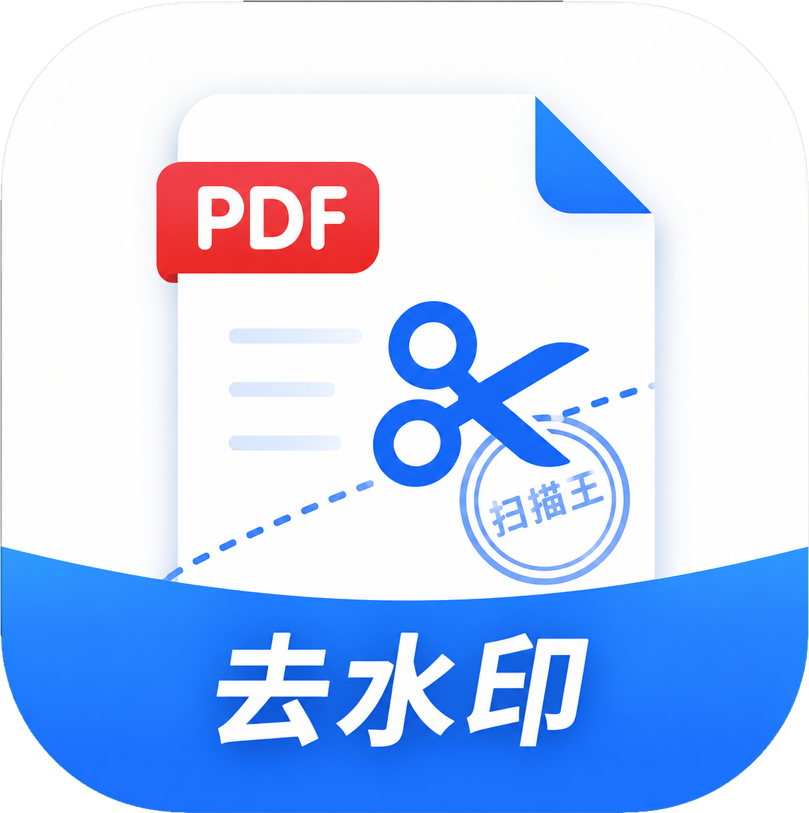

# 夸克去水印 - Android 版

去除夸克扫描王 PDF 中的水印，纯本地处理，无需联网。

## 功能

- 选择 PDF 文件，一键去除水印
- 批量处理多个文件
- 纯本地处理，不上传任何文件
- 处理后可保存到本地或分享给其他应用
- 单文件直接分享 PDF，多文件自动打包 ZIP（兼容微信/QQ）

## 技术方案

- 语言：Kotlin
- UI：Jetpack Compose + Material3
- PDF 库：iText 7.2.5
- 核心逻辑：解析 PDF 内容流，正则匹配并移除 `QuarkX2` 水印指令

## 构建

```bash
# Debug 版本
./gradlew assembleDebug

# Release 版本
./gradlew assembleRelease
```

## 下载

从 [Releases](../../releases) 页面下载最新 APK。

## 截图

<p align="center">
  
</p>
